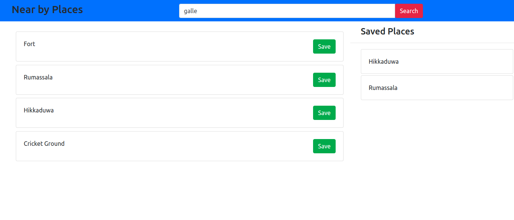

A simple Single Page Application that consists of a NodeJS backend to search near by places and save them in a side list. Implemented to learn the basic concepts of ReactJS.

## Available Scripts

In the project directory, you can run:

### `npm start`

Runs the app in the development mode. 
Open [http://localhost:3000](http://localhost:3000) to view it in the browser.

The page will reload if you make edits. 
You will also see any lint errors in the console.

**To start NodeJS server
Open another terminal, go to backend directory and run the command

### `node app.js`

NodeJS server will start on [http://localhost:3001](http://localhost:3001)
